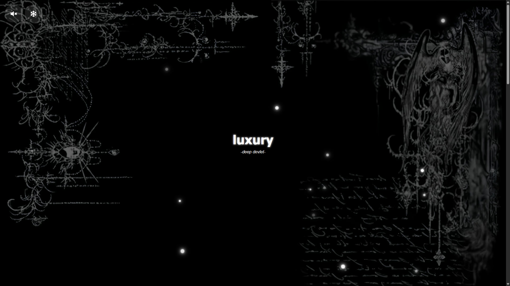
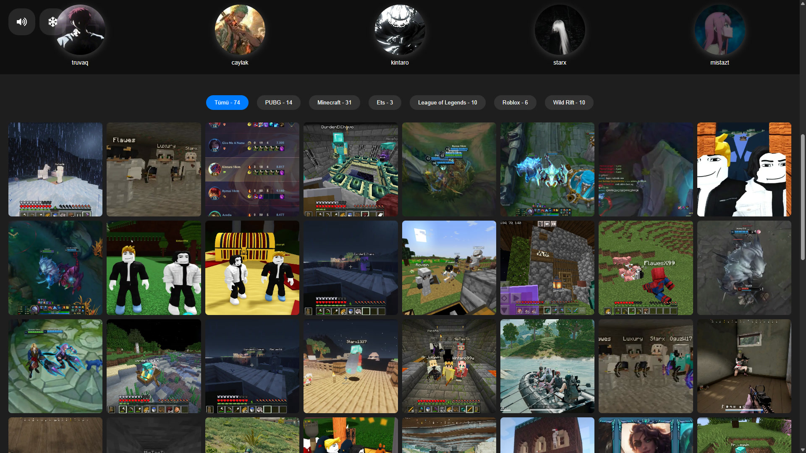

<a href="README.md">
 
</a>
<a href="README-TR.md">
 
</a>

  <br />
  <br />

<div align="center">
  
  <br />
  <br />

  <p>
    Modern Website for Storing Gaming Memories with Friends
  </p>


  <p>
    <a href="#features">Features</a> •
    <a href="#technologies">Technologies</a> •
    <a href="#installation">Installation</a> •
    <a href="#license">License</a> •
    <a href="#gallery">Gallery</a>
  </p>

  <br />
  <br />
</div>

## 📷 Demo Link

- [https://xkintaro.github.io/memories/](https://xkintaro.github.io/memories)
- [https://memories-gules-mu.vercel.app/](https://memories-gules-mu.vercel.app/)

## 📋 About

I built this website to preserve gaming memories shared with my friends during the time I started learning React.

## ✨ Features <a id="features"></a>

- **Dynamic Banner:** Random fonts and greetings that change upon page load and during runtime.
- **Music Experience:** Background music, volume control, and mute features.
- **Friend List:** Automatically scrolling and randomly ordered friend profile cards.
- **Categorized Gallery:** An extensive collection of memories filterable by games (PUBG, Minecraft, ETS, LoL, Roblox, Wild Rift).
- **Image Modal:** Ability to view photos in full size.
- **Snow Effect:** Optional snowfall effect that changes the atmosphere.
- **Responsive Design:** Interface compatible with all devices (Mobile, Tablet, Desktop).

## 🛠️ Technologies <a id="technologies"></a>

- **React 19**: User interface components.
- **Vite**: High-performance development and build tool.
- **Vanilla CSS**: Custom design, glassmorphism effects, and animations.

## 🚀 Installation <a id="installation"></a>

You can follow these steps to run the project on your local machine:

1. **Clone the repository:**

   ```bash
   git clone https://github.com/xkintaro/memories.git
   cd memories
   ```

2. **Install dependencies:**

   ```bash
   npm install
   ```

3. **Run the application:**

   ```bash
   npm run dev
   ```

   The application will run at `http://localhost:5173`.

## 📄 License <a id="license"></a>

This project is licensed under the MIT License. You can check the [LICENSE](LICENSE) file for details.

## 🖼️ Gallery <a id="gallery"></a>



##



#

<p align="center">
  <sub>❤️ Developed by "Mustafa TAŞAL" (kintaro)</sub>
</p>
